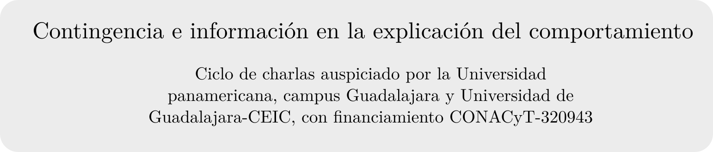
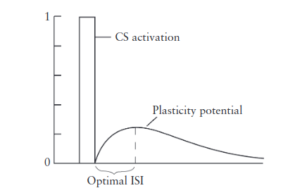
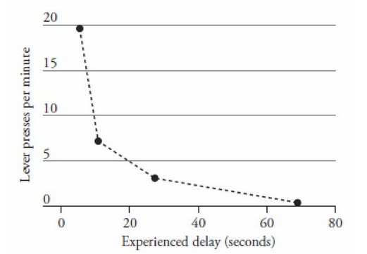

class: title-slide center

```{r setup, include=FALSE}
library(knitr)
library(xaringan)
options(htmltools.dir.version = FALSE)
opts_chunk$set(echo=FALSE, fig.pos = "H")
```


```{r xaringan-themer, include=FALSE, warning=FALSE}
library(xaringanthemer)
style_duo(
  base_font_size = "22px",
  primary_color = "white",
  background_color = "white",
  inverse_header_color = "#BB945D",
  secondary_color = "#12695E",
  title_slide_text_color = "#970639",
  text_color = "#12695E",
  text_font_family = "Latin Modern Sans",
  header_h1_font_size = "2.2rem",
  text_font_size = '1.2rem',
  header_font_family = "Latin Modern Sans",
  code_font_family = "FiraCode Nerd Font"
)

```

# `r rmarkdown::metadata$title`
## `r rmarkdown::metadata$subtitle`

.author[
`r rmarkdown::metadata$author`
]

.date[
11-noviembre-2022
]



---
class: inverse,  middle

# Cuatro concepciones de contingencia

- Contingencia como contigüidad

--

- Contingencia como probabilidad diferencial 

--

- Contingencia como covarianza

--

- Contingencia como información mutua 

---

# Contingencia como contigüidad

«Decir que un reforzador es contingente a la respuesta podría significar no más que sigue a la respuesta» - "Superstition in the pigeon" - Skinner, 1948

Si se concibe la contingencia como una condición que promueve el aprendizaje o mantiene la conducta, lo anterior es falso.

--

- Diversos experimentos en los 60s mostraron que la contigüidad no es necesaria ni suficiente (aparentemente). 

--

- Por ejemplo, el procedimiento *verdaderamente aleatorio* de Rescorla, o el fenómeno de bloqueo, o el de validez relativa de Wagner.

---

Sin embargo, no significa que la contigüidad no juege un papel importante. 

--

.pull-left[
```{r isi-function, out.width='100%', fig.cap='ISI function (Gallistel, 1990).'}

```
]

--

.pull-right[
```{r delay, out.width='100%', fig.cap='Delay gradient (Dickinson et al, 1992).'}

```
]

---

# Contingencia como probabilidad diferencial

«La idea de contingencia usada aquí necesita explicarse. Por [contingencia] queremos decir el .inverse[grado de dependencia] que tiene la presentación del EI sobre la presentación previa del EC [...] Esto claramente es una función de la .inverse[proporción] de los EI que ocurren durante o en algún .inverse[tiempo especificado] que sigue al EC [...] Esas proporciones pueden formularse en términos de la .inverse[probabilidad] de que un EI ocurra dada la presencia de un EC (o dado que el EC ocurrió en un tiempo anterior designado) y la probabilidad de un EI dada la ausencia del EC.» - Rescorla, 1967

--

$$
\text{Contingencia}_p = p(\text{EI}\mid \text{EC}_t) - p(\text{EI}\mid \text{noEC}_t)
$$

---

Asumiendo que un ensayo es un $t$ especificado entre el inicio y fin de un EC:

- Si el EC y noEC ocurren en un «tiempo especificado», ¿cuánto es ese tiempo? ¿Existe una ventana de 'detección'? Recordar la función ISI.

--

- Si dividimos una sesión en periodos en donde ocurren apareamientos EC-EI, donde no ocurre el EC pero sí el EI, y donde no ocurre ninguno de los dos: ¿Qué es un no ensayo como para poder computar $p(\text{EI}\mid \text{noEC}_t)$? Si un ensayo es una demarcación de dos eventos (inicio y fin de EC), ¿cuánto dura un noEC? ¿Cuántos EI deben ocurrir en un noEC?

---

.strong[¿Cómo lo hizo Rescorla?]
--

```{r rescorla1968, out.width='50%', fig.cap='', fig.pos}
knitr::include_graphics('./img/rescorla1968.png')
```

- En el experimento clásico de Rescorla de 1968<sup>1</sup>, fundamental en esta visión, se usaron diferentes $p(\text{EI}\mid \text{noEC})$. Se presentaron 12 ensayos de 2 min, con un intervalo entre ensayos *promedio* de 8 min.

.footnote[1."Probability of shock in the presence and absence of CS in fear conditioning"]

---

- Los choques fueron programados aleatoriamente *en toda la sesión*, de 2h de duración. Cada segundo se evaluaba con $p(\text{EI})$ si se administraba choque o no (cada ensayo fue un ensayo de Bernuilli, lo que arroja una distribución geométrica, o exponencial, de intervalos entre choques!).

--

- Lo que se manipuló fue un parámetro de un proceso de Poisson (eventos por segundo): «Only the .inverse[expected] probability of US were explicitly programmed; the .inverse[actual] sequence [es decir, la distribución exponencial] of US was generated separately». Uno para el EI durante el EC, otro para el EI en su ausencia.

- Hubo 12 EC en cada una de las 5 sesiones de condicionamiento. En total 60 ensayos. Por ejemplo, para $p(\text{EI}\mid \text{EC}_t) = p(\text{EI}\mid \text{noEC}_t)=0.4$, la tasa de choques fue de 0.26/min, (Gallistel, 2021), que multiplicado por 60 ensayos daría 31.2 choques, en 60 ensayos; $31.2/60\neq 0.4$.

- Con un proceso como este, 