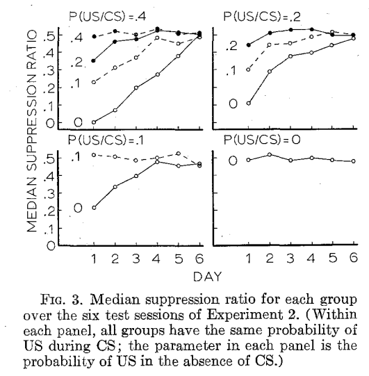
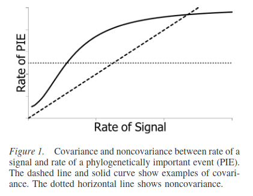

class: title-slide center

```{r setup, include=FALSE}
library(knitr)
library(xaringan)
library(reticulate)
options(htmltools.dir.version = FALSE)
opts_chunk$set(echo=FALSE, fig.pos = "H")
```


```{r xaringan-themer, include=FALSE, warning=FALSE}
library(xaringanthemer)
style_duo(
  base_font_size = "22px",
  primary_color = "white",
  background_color = "white",
  inverse_header_color = "#BB945D",
  secondary_color = "#12695E",
  title_slide_text_color = "#970639",
  text_color = "#12695E",
  text_font_family = "Latin Modern Sans",
  header_h1_font_size = "2.2rem",
  text_font_size = '1.2rem',
  header_font_family = "Latin Modern Sans",
  code_font_family = "FiraCode Nerd Font"
)

```

# `r rmarkdown::metadata$title`
## `r rmarkdown::metadata$subtitle`

.author[
`r rmarkdown::metadata$author`
]

.date[
11-noviembre-2022
]


---
class: inverse,  middle

# Cuatro concepciones de contingencia
--

- Contingencia como contigüidad

--

- Contingencia como probabilidad diferencial 

--

- Contingencia como covarianza

--

- Contingencia como información mutua 

---

# Contingencia como contigüidad

«Decir que un reforzador es contingente a la respuesta podría significar no más que sigue a la respuesta» - "Superstition in the pigeon" - Skinner, 1948

Si se concibe la contingencia como una condición que promueve el aprendizaje o mantiene la conducta, lo anterior es falso.

--

- Diversos experimentos en los 60s mostraron que la contigüidad no es necesaria ni suficiente (aparentemente). 

--

- Por ejemplo, el procedimiento *verdaderamente aleatorio* de Rescorla, o el fenómeno de bloqueo, o el de validez relativa de Wagner.

---

Sin embargo, no significa que la contigüidad no juege un papel importante. 

--

.pull-left[
```{r isi-function, out.width='100%', fig.cap='ISI function (Gallistel, 1990).'}

```
]

--

.pull-right[
```{r delay, out.width='100%', fig.cap='Delay gradient (Dickinson et al, 1992).'}

```
]

---

# Contingencia como probabilidad diferencial

«La idea de contingencia usada aquí necesita explicarse. Por [contingencia] queremos decir el .inverse[grado de dependencia] que tiene la presentación del EI sobre la presentación previa del EC [...] Esto claramente es una función de la .inverse[proporción] de los EI que ocurren durante o en algún .inverse[tiempo especificado] que sigue al EC [...] Esas proporciones pueden formularse en términos de la .inverse[probabilidad] de que un EI ocurra dada la presencia de un EC (o dado que el EC ocurrió en un tiempo anterior designado) y la probabilidad de un EI dada la ausencia del EC.» - Rescorla, 1967

--

$$
\text{Contingencia}_p = p(\text{EI}\mid \text{EC}_t) - p(\text{EI}\mid \text{noEC}_t)
$$

---

Asumiendo que un ensayo es un $t$ especificado entre el inicio y fin de un EC:

- Si el EC y noEC ocurren en un «tiempo especificado», ¿cuánto es ese tiempo? ¿Existe una ventana de 'detección'? Recordar la función ISI.

--

- Si dividimos una sesión en periodos en donde ocurren apareamientos EC-EI, donde no ocurre el EC pero sí el EI, y donde no ocurre ninguno de los dos: ¿Qué es un no ensayo como para poder computar $p(\text{EI}\mid \text{noEC}_t)$? Si un ensayo es una demarcación de dos eventos (inicio y fin de EC), ¿cuánto dura un noEC? ¿Cuántos EI deben ocurrir en un noEC?

---

.strong[¿Cómo lo hizo Rescorla?]
--

.pull-left[
```{r rescorla1968, out.width='70%', fig.cap='Rescorla 1968'}

```
]
--

.pull-right[

- En el experimento clásico de Rescorla de 1968<sup>1</sup>, se usaron diferentes $p(\text{EI}\mid \text{noEC})$. Se presentaron 12 ensayos de 2 min, con un intervalo entre ensayos *promedio* de 8 min.

- Los choques fueron programados aleatoriamente *en toda la sesión*. Cada segundo se evaluaba con $p(\text{EI})$ si se administraba choque o no (¡los intervalos EI tenían distribución exponencial!).

]

.footnote[1."Probability of shock in the presence and absence of CS in fear conditioning"]

---

- Lo que se manipuló fue un parámetro de un proceso de Poisson (eventos por segundo): «Only the .inverse[expected] probability of US were explicitly programmed; the .inverse[actual] sequence [es decir, la distribución exponencial] of US was generated separately». Uno para el EI durante el EC, otro para el EI en su ausencia.

- Hubo 12 EC en cada una de las 5 sesiones de condicionamiento. En total 60 ensayos. Por ejemplo, para $p(\text{EI}\mid \text{EC}_t) = p(\text{EI}\mid \text{noEC}_t)=0.4$, la tasa de choques fue de 0.26/min, (Gallistel, 2021), que multiplicado por 60 ensayos daría 31.2 choques, en 60 ensayos; $31.2/60\neq 0.4$

- ¿Por qué no es 0.4? Porque lo que modeló Rescorla fue la probabilidad de recibir un choque o más durante el EC. Lo que importó fue la cantidad de EC durante los cuáles no hubo choque, del 60%.

- Esto podía suceder porque la probabilidad del EI se calculaba segundo a segundo. 

---

- La distribución de choques durante los no-ensayos se vería de esta manera:

```{r poisson, out.width='40%', fig.cap='Proceso de Poisson (Gallistel, 2021)', fig.align = 'center'}

```

- El problema es separar el tiempo en intervalos. Hay intervalos de EC, de EI e intervalos EC-EC. Durante esos intervalos, en algunos ocurriría el EC/EI, en otros no (noEC/noEI). Estos no-eventos se consideran fallas de ocurrencia de EC/EI en el momento en el que .inverse[se espera que sucedan].

---

## Contingencia como correlación/covarianza

--

- Originalmente, Baum propuso la que la contingencia es mejor entendida como correlación entre eventos aleatorios: la tasa de respuesta y la tasa de reforzadores.

--

- Actualmente, por alguna razón, prefiere referirse a esto como *covarianza*. 

--

- La correlación y la covarianza están relacionadas entre sí por la desviación estándar

$$
\begin{equation*}
  \text{Cov}[x, y] = \frac{1}{n} \sum_{x,y}(x - \mathbb{E}[x])(y - \mathbb{E}[y])=\frac{1}{n} \mathbf{x}_0^\top \mathbf{y}_0
\end{equation*}
$$

\begin{align*}
    \rho = \cos \theta &= \frac{\frac{1}{n} \mathbf{x}_0^\top \mathbf{y}_0}{\sqrt{1/n}\| \mathbf{x}_0 \| \sqrt{1/n}\| \mathbf{y}_0 \| }\\
      &= \frac{\mathbf{x}_0^\top \mathbf{y}_0}{\| \mathbf{x}_0 \| \| \mathbf{y}_0 \| } = \frac{\text{Cov}[x, y]}{\text{SD}[x]\times \text{SD}[y]}
\end{align*}

---

- Baum<sup>2</sup> traza el origen de su *ley* en la intuición de Rescorla que ya mencioné.
--

- Por alguna razón, define la dependencia entre dos tasas de eventos en términos de covarianza incluso cuando la relación es no lineal

```{r baum_cov, out.width='50%', fig.cap='', fig.align='center'}

```

.footnote[2 Three Laws: Allocation, Induction, and Covariance]

---

- Pero, además, una tasa es cantidad de eventos por unidad de tiempo.

--

- Baum también sugiere que la conducta operante constituye un bucle de retroalimentación negativa

--

.pull-left[
```{r feedback, out.width='90%', fig.cap='', fig.align='center'}
knitr::include_graphics('./img/baum_feedback.png')
```

- La actividad produce reforzadores.
- Los reforzadores inducen actividad.

]

--

.pull-right[

- Suponiendo que es un aire acondicionado, con un termostato, con un punto fijo (set-point) de 24°C.

```{r stepfbck, out.width='60%', fig.cap='', fig.align='center'}

```
- Cambios en la temperatura van seguidos de cambios en el aire acondicionado.
]

---

```{r stepfbck2, out.width='45%', fig.cap='', fig.align='center'}

```

- Ambos se compensan. En el límite, la diferencia entre el set-point y la temperatura ambiental es 0.

- Si obtenemos una regresión entre los cambios en la temperatura y los cambios en el aire acondicionado no dirá mucho. La correlación será de 0.

- Lo cual no significa que no haya una relación entre ambos. Simplemente, en estado estable ambas variables están en equilibrio.

- No parece que la covarianza/correlación pueda explicar el mantenimiento de la conducta. 

---

# Contingencia como información

--

- Gallistel no parece diferir con Baum en lo fundamental: «The contingencies of ordinary experience, however, are defined over time»<sup>3</sup>.

--

- Para computar una correlación debemos tener dos vectores aleatorios: el de tasa de respuesta y el de tasa de reforzamiento.

--

- Si lo que varió Rescorla fue el parámetro de una distribución, tiene sentido que lo que comparemos sean distribuciones.
--

- En particular, si la conducta es sensible a la distribución de los intervalos entre reforzadores, podria decirse que los eventos «transmiten información sobre los demás en la medida en que la ocurrencia de un evento reduce la incertidumbre sobre el otro»<sup>3</sup>.

.footnote[3 Gallistel et al., Temporal contigency]

---

- Una medida de contigencia, según Gallistel, debe tener en cuenta las siguientes características:

--

  - Debe ser medible.
  - Debe tener en cuenta el tiempo de ocurrencia.
  - Debe poder aplicarse a cualquier tipo de dependencia.
  - No debe depender de la discretización del tiempo en segmentos arbitrarios.

--

- En la pasada sesión definimos la información con base en dos propiedades:

  - **La información debe ser extensiva y aditiva**. La combinación de dos conjuntos de información con la misma cantidad duplican la información. 
  - **La información reduce la incertidumbre**. La cantidad de información es una función monotónica estrictamente decreciente de la incertidumbre de un evento. Cuanto más probable es un evento, menos información conlleva; cuanto menos probable, más información conlleva.

---

$$
  I(x) = -\log_b(p(x)) =  \log_b\frac{1}{p(x)}
$$

```{r infox, fig.height=5, fig.width=6, fig.cap='', fig.align='center'}
fun_ix <- function(x){
  -log(x)
}
x <- seq(0, 1, 0.01)
par(las=1)
plot(x, fun_ix(x), type = 'l', ylab = 'I(x)')
```

Definimos también la *entropía* como la información promedio

$$
  H(x) = \sum_{i=1}^n p_i \log_b\frac{1}{p_i}
$$

---

- Suponer un programa de IV, en el que los intervalos entre reforzadores (IRI) tienen una distribución exponencial.

```{r exp, fig.height=3.5, fig.width=4, fig.cap='', fig.align='center'}
par(las=1, mgp=c(0.5,0,0))
curve(dexp(x, 1/30), from = 0, to = 270, axes=FALSE, ylab = 'p(IRI)', xlab='IRI')
box()
```

- Es decir, los intervalos pequeños son más frecuentes.

--

- Los intervalos entre respuestas (iri) son más cortos en promedio. La mayoría de ellos no produce reforzadores.

--

- De vez en cuando, uno de ellos los produce.

---

- ¿Cuál es la contingencia?

--

- Si queremos medir como la tasa de respuestas reduce la incertidumbre de la ocurrencia del reforzador, podemos considerar la distribuciones de los iri con respecto a los IRI.

--

- Comenzamos, primero, estimando la distribución conjunta $p(\text{IRI}, \text{iri})$, una distribución sobre todas las posibles combinaciones de IRI,iri.

--

- De nuevo, si queremos saber cómo la distribución de respuestas en el tiempo reduce la incertidumbre de ocurrencia del reforzador, en teoría de la información queremos saber la información mutua entre dos distribuciones: 

  - ¿cuánta incertidumbre se reduce sobre los IRIs respondiendo a cierta tasa (es decir, con un iri promedio)?

$$
  I(\text{IRI};\text{iri}) = H(\text{IRI}) - H(\text{IRI}\mid \text{iri})
$$

---

## Coeficiente de incertidumbre

A partir de la información mutua, definimos una cantidad relacionada llamada *coeficiente de incertidumbre**.

$$
C_{\text{IRI,iri}}=\frac{  I(\text{IRI};\text{iri}) }{H(\text{IRI})}
$$

Dado los iri, ¿qué fracción de IRI podemos predecir? Dicho de otra manera, podemos decir qué dependencia tienen los iri con respecto a los IRI. Es decir, *una medida de contingencia*.

--

Si la distribución de IRI y de iri son independientes, la información mutua es 0. No hay contingencia. La entropía condicional de $IRI$ dado $iri$ es la entropía de $IRI$, dado que $iri$ no conlleva información sobre $IRI$ al ser independiente. Por lo tanto, $I(IRI;iri)$ = 0. Esto debido a que $H(IRI|iri)$ es la entropía de $p(IRI|iri)$.
